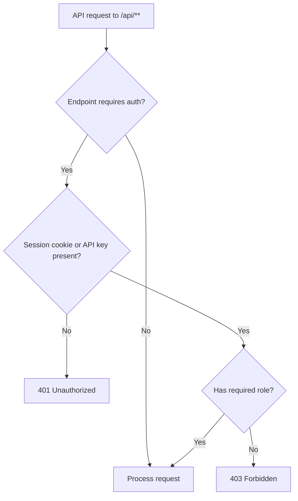
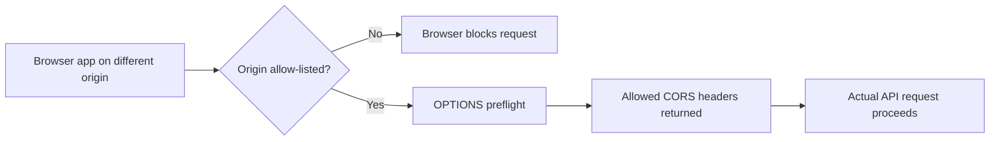

# REST API Reference

Kairos exposes a JSON REST API under the `/api` prefix.

## Interactive API Documentation (Swagger UI)

An interactive API explorer is available at **`/api`** once the application is running.

```
http://localhost:8080/api
```

The UI is generated automatically from the OpenAPI specification and allows you to browse all endpoints, inspect request/response schemas, and execute requests directly in the browser. No authentication is required to view the documentation — authenticated endpoints will prompt for credentials when you use *Try it out*.

The raw OpenAPI JSON spec is available at `/v3/api-docs`.

---

## Authentication

Protected endpoints support two authentication methods:

1. **Session cookie** (`JSESSIONID`) from `/login`
2. **Scoped API key JWT** (`Authorization: Bearer <token>`) created in **Admin → API Keys**

See [API keys and permissions](api-keys.md) for creation, rotation, migration behavior, and least-privilege examples.

### Authentication Decision Flow



### Session-based authentication

Log in via the browser login form or programmatically:

```bash
# Obtain a session cookie
curl -c cookies.txt -X POST http://localhost:8080/login \
  -d "username=admin%40kairos.local&*****"
```

> Note: Spring Security CSRF protection is active for session-based authentication. Browser-initiated requests include the token automatically. For programmatic access with session cookies, retrieve the CSRF token from the login page first (look for `<input name="_csrf">`) and include it in POST/PUT/DELETE requests.

### API key JWT authentication

Admins can create API keys in the Admin panel:

1. Open `Admin → API Keys`.
2. Enter a key name and select at least one permission.
3. Create the key and copy the token immediately (**shown only once**).

Use the token in the `Authorization` header:

```bash
curl -H "Authorization: Bearer <api-key-jwt>" http://localhost:8080/api/resources
```

You can also use the alternative header prefix:

```bash
Authorization: ApiKey <api-key-jwt>
```

### Endpoint access summary

| Endpoint | API-key permission |
|----------|---------------|
| `GET /api/resources` | Public |
| `GET /api/resources/{id}` | Public |
| `POST /api/resources` | `RESOURCE_MANAGE` |
| `POST /api/resources/templates` | `RESOURCE_MANAGE` |
| `DELETE /api/resources/{id}` | `RESOURCE_MANAGE` |
| `GET /api/resources/{id}/history` | `STATUS_READ` |
| `GET /api/announcements` | Public |
| `GET /api/announcements/{id}` | Public |
| `POST /api/announcements` | `ANNOUNCEMENT_MANAGE` |
| `PUT /api/announcements/{id}` | `ANNOUNCEMENT_MANAGE` |
| `DELETE /api/announcements/{id}` | `ANNOUNCEMENT_MANAGE` |

Public entries remain public only while public access is enabled. If it is disabled, API keys need `STATUS_READ`. Administrator sessions retain management access.

Resource visibility note:

- `GET /api/resources` and `GET /api/resources/{id}` return only resources visible under their group visibility policy.
- A resource can belong to **multiple groups**. The **most-permissive** visibility across all assigned groups is applied.
- Resources whose effective visibility is `AUTHENTICATED` are omitted for anonymous callers.
- Resources whose effective visibility is `HIDDEN` (all groups are `HIDDEN` and there is no more-permissive group) are omitted for all public API views.
- Ungrouped resources are always returned.

---

## CORS (Cross-Origin Resource Sharing)

When a browser application hosted on a **different origin** (domain, port, or scheme) calls the Kairos API, the browser enforces the [same-origin policy](https://developer.mozilla.org/en-US/docs/Web/Security/Same-origin_policy) and blocks the request unless the server responds with the appropriate CORS headers.

> Note: CORS is a **browser-only restriction**. Server-to-server calls (e.g. `curl`, backend services) are never affected and always work without CORS configuration.

### Cross-Origin Request Flow



### How to allow an origin

1. Open **Admin → General Settings**.
2. Scroll to the **API CORS Allowed Origins** card.
3. Enter the full origin in the format `https://example.com` (scheme + host + optional port, **no trailing slash**).
4. Click **Add Origin**.

The change takes effect immediately — no restart is required. Each entry is stored in the database and applied per-request.

### Origin format rules

| ✅ Valid | ❌ Invalid |
|---------|----------|
| `https://example.com` | `example.com` (missing scheme) |
| `https://app.example.com` | `https://example.com/` (trailing slash) |
| `http://localhost:3000` | `https://example.com/app` (path included) |
| `https://example.com:8443` | `*` (wildcards are not supported) |

### Removing an origin

Click the **trash icon** next to any origin in the **API CORS Allowed Origins** table. The origin is removed immediately.

### Browser preflight requests

Browsers send an `OPTIONS` preflight before mutating cross-origin requests. Kairos handles these automatically for all configured origins. There is no additional setup required.

### CORS is scoped to `/api/*` only

CORS headers are only added to requests matching the `/api/` path prefix. UI pages (`/`, `/admin/**`, etc.) are not affected.

### No allowed origins configured

If no origins are configured, the CORS headers are **not sent** for any cross-origin request. Browsers will block such requests. This is the secure default.

---

## Resource Endpoints

### `GET /api/resources`

Returns all **active** monitored resources visible to the current caller under group visibility policy.

**Response** `200 OK`

```json
[
  {
    "id": 1,
    "name": "GitHub",
    "resourceType": "HTTP",
    "target": "https://github.com",
    "skipTLS": false,
    "active": true,
    "createdAt": "2024-01-15T10:00:00"
  },
  {
    "id": 2,
    "name": "nginx (Docker)",
    "resourceType": "DOCKER",
    "target": "nginx:alpine",
    "active": true,
    "createdAt": "2024-01-15T10:05:00"
  }
]
```

---

### `GET /api/resources/{id}`

Returns a single resource by ID including general information and latest health status.

Returns `404` when the resource does not exist **or** is not visible to the caller due to group visibility policy.

**Response** `200 OK`

```json
{
  "id": 1,
  "name": "GitHub",
  "resourceType": "HTTP",
  "target": "https://github.com",
  "groupId": 3,
  "groupName": "External",
  "groups": [
    { "id": 3, "name": "External" },
    { "id": 7, "name": "CI/CD" }
  ],
  "skipTLS": false,
  "active": true,
  "createdAt": "2026-03-11T10:00:00",
  "currentStatus": "available",
  "latestCheckStatus": "AVAILABLE",
  "latestCheckedAt": "2026-03-11T10:30:00",
  "latestMessage": "HTTP 200",
  "latestErrorCode": "200"
}
```

> **Note:** `groupId` and `groupName` are retained for backward compatibility and reflect the first group (sorted by ID). Prefer the `groups` array for multi-group-aware clients.

**Response** `404 Not Found` — if the resource ID does not exist or is not visible to the caller due to group visibility policy.

---

### `POST /api/resources`

Add a new resource to monitor.

**Request body**

```json
{
  "name": "My Service",
  "resourceType": "HTTP",
  "target": "https://example.com",
  "skipTLS": false,
  "recursive": false
}
```

| Field | Type | Values | Required |
|-------|------|--------|----------|
| `name` | string | Any display name | Yes |
| `resourceType` | string | `HTTP`, `DOCKER`, or `TCP` | Yes |
| `target` | string | Full URL (HTTP), Docker image reference (DOCKER), or `host:port` (TCP) | Yes |
| `skipTLS` | boolean | `true` or `false`; applies to HTTPS connections (HTTP checks and Docker registry checks) | No |
| `recursive` | boolean | `true` or `false`; used by resource types that support recursive behavior | No |

**Response** `200 OK` — the created resource object

**Example**

```bash
curl -b cookies.txt -X POST http://localhost:8080/api/resources \
  -H "Content-Type: application/json" \
  -d '{"name":"Example","resourceType":"DOCKER","target":"ghcr.io/jfwenisch/example:latest","skipTLS":false,"recursive":false}'
```

---

### `DELETE /api/resources/{id}`

Permanently deletes a resource and all its check history.

**Response** `200 OK`

```json
{ "status": "deleted" }
```

**Example**

```bash
curl -b cookies.txt -X DELETE http://localhost:8080/api/resources/3
```

---

### `GET /api/resources/{id}/history`

Returns the full check history for a resource, sorted most recent first.

**Response** `200 OK`

```json
[
  {
    "id": 42,
    "status": "AVAILABLE",
    "message": "HTTP 200",
    "errorCode": "200",
    "checkedAt": "2024-01-15T11:01:00"
  },
  {
    "id": 41,
    "status": "NOT_AVAILABLE",
    "message": "Connection refused",
    "errorCode": "CONNECTION_ERROR",
    "checkedAt": "2024-01-15T10:01:00"
  }
]
```

**Response** `404 Not Found` — if the resource ID does not exist.

| Field | Values |
|-------|--------|
| `status` | `AVAILABLE`, `NOT_AVAILABLE` |
| `errorCode` | HTTP status code (e.g. `200`, `503`), `CONNECTION_ERROR`, or `DOCKER_ERROR` |

---

## Announcement Endpoints

### `GET /api/announcements`

Returns all announcements (active and inactive) ordered by creation date descending.

**Response** `200 OK`

```json
[
  {
    "id": 1,
    "kind": "WARNING",
    "content": "<p>Scheduled maintenance on Saturday.</p>",
    "createdBy": "admin@kairos.local",
    "active": true,
    "activeUntil": "2026-03-15T06:00:00",
    "createdAt": "2026-03-11T08:00:00",
    "updatedAt": "2026-03-11T08:00:00"
  }
]
```

---

### `GET /api/announcements/{id}`

Returns a single announcement by ID.

**Response** `200 OK` — announcement object (same schema as above)  
**Response** `404 Not Found` — if the ID does not exist.

---

### `POST /api/announcements`

Creates a new announcement. `createdBy` is set automatically from the authenticated user. Requires `ADMIN` role.

**Request body**

```json
{
  "kind": "INFORMATION",
  "content": "<p>New feature released.</p>",
  "active": true,
  "activeUntil": null
}
```

| Field | Type | Values | Required |
|-------|------|--------|----------|
| `kind` | string | `INFORMATION`, `WARNING`, `PROBLEM` | Yes |
| `content` | string | HTML string | Yes |
| `active` | boolean | `true` / `false` | Yes |
| `activeUntil` | datetime | ISO-8601 datetime or `null` | No |

**Response** `200 OK` — the created announcement object

**Example**

```bash
curl -b cookies.txt -X POST http://localhost:8080/api/announcements \
  -H "Content-Type: application/json" \
  -d '{"kind":"INFORMATION","content":"<p>Hello.</p>","active":true,"activeUntil":null}'
```

---

### `PUT /api/announcements/{id}`

Fully replaces an existing announcement's fields. `createdBy` and `createdAt` are preserved. Requires `ADMIN` role.

**Request body** — same schema as `POST /api/announcements`

**Response** `200 OK` — the updated announcement object  
**Response** `404 Not Found` — if the ID does not exist.

**Example**

```bash
curl -b cookies.txt -X PUT http://localhost:8080/api/announcements/1 \
  -H "Content-Type: application/json" \
  -d '{"kind":"WARNING","content":"<p>Updated.</p>","active":false,"activeUntil":null}'
```

---

### `DELETE /api/announcements/{id}`

Permanently deletes an announcement. Requires `ADMIN` role.

**Response** `200 OK`

```json
{ "status": "deleted" }
```

**Example**

```bash
curl -b cookies.txt -X DELETE http://localhost:8080/api/announcements/1
```

---

## Resource types

### `HTTP`

Performs an HTTP GET to the `target` URL with a 15-second timeout. A `2xx` response is considered **AVAILABLE**; any other status code or connection error is **NOT_AVAILABLE**.

### `DOCKER`

Validates Docker/OCI pullability via registry API calls (manifest + blob probes). A successful probe is **AVAILABLE**; any registry/auth/pullability error is **NOT_AVAILABLE**.

Resource discovery (for example Docker namespace/repository discovery) is configured in the Admin UI under **Admin -> Resource Discovery**, not via `resourceType` in this API.

---

## Prometheus metrics endpoint

Not part of the REST API, but useful alongside it:

```
GET /actuator/prometheus
```


### `GET /api/resources`

Returns all **active** monitored resources visible to the current caller under group visibility policy.

**Response** `200 OK`

```json
[
  {
    "id": 1,
    "name": "GitHub",
    "resourceType": "HTTP",
    "target": "https://github.com",
    "active": true,
    "createdAt": "2024-01-15T10:00:00"
  },
  {
    "id": 2,
    "name": "nginx (Docker)",
    "resourceType": "DOCKER",
    "target": "nginx:alpine",
    "active": true,
    "createdAt": "2024-01-15T10:05:00"
  }
]
```

---

### `GET /api/resources/{id}`

Returns a single resource by ID including general resource information and latest health status.

Returns `404` when the resource does not exist **or** is not visible to the caller due to group visibility policy.

**Response** `200 OK`

```json
{
  "id": 1,
  "name": "GitHub",
  "resourceType": "HTTP",
  "target": "https://github.com",
  "active": true,
  "createdAt": "2026-03-11T10:00:00",
  "currentStatus": "available",
  "latestCheckStatus": "AVAILABLE",
  "latestCheckedAt": "2026-03-11T10:30:00",
  "latestMessage": "HTTP 200",
  "latestErrorCode": "200"
}
```

**Response** `404 Not Found` — if the resource ID does not exist.

---

### `POST /api/resources`

Add a new resource to monitor.

**Request body**

```json
{
  "name": "My Service",
  "resourceType": "HTTP",
  "target": "https://example.com",
  "skipTLS": false,
  "recursive": false
}
```

| Field | Type | Values | Required |
|-------|------|--------|----------|
| `name` | string | Any display name | Yes |
| `resourceType` | string | `HTTP`, `DOCKER`, or `TCP` | Yes |
| `target` | string | Full URL (HTTP), Docker image reference (DOCKER), or `host:port` (TCP) | Yes |
| `skipTLS` | boolean | `true` or `false`; applies to HTTPS connections | No |
| `recursive` | boolean | `true` or `false`; used by resource types that support recursive behavior | No |

**Response** `200 OK` — the created resource object

```json
{
  "id": 3,
  "name": "My Service",
  "resourceType": "HTTP",
  "target": "https://example.com",
  "skipTLS": false,
  "recursive": false,
  "active": true,
  "createdAt": "2024-01-15T11:00:00"
}
```

**Example**

```bash
curl -b cookies.txt -X POST http://localhost:8080/api/resources \
  -H "Content-Type: application/json" \
  -d '{"name":"Example","resourceType":"DOCKER","target":"ghcr.io/jfwenisch/example:latest","recursive":false}'
```

---

### `DELETE /api/resources/{id}`

Permanently deletes a resource and its check history.

**Response** `200 OK`

```json
{
  "status": "deleted"
}
```

**Example**

```bash
curl -b cookies.txt -X DELETE http://localhost:8080/api/resources/3
```

---

### `GET /api/resources/{id}/history`

Returns the full check history for a resource, sorted by most recent first.

**Response** `200 OK`

```json
[
  {
    "id": 42,
    "status": "AVAILABLE",
    "message": "HTTP 200",
    "errorCode": "200",
    "checkedAt": "2024-01-15T11:01:00"
  },
  {
    "id": 41,
    "status": "NOT_AVAILABLE",
    "message": "Connection refused",
    "errorCode": "CONNECTION_ERROR",
    "checkedAt": "2024-01-15T10:01:00"
  }
]
```

**Response** `404 Not Found` — if the resource ID does not exist.

| Field | Values |
|-------|--------|
| `status` | `AVAILABLE`, `NOT_AVAILABLE` |
| `errorCode` | HTTP status code (e.g. `200`, `503`), `CONNECTION_ERROR`, or `DOCKER_ERROR` |

---

## Resource types

### `HTTP`

Performs an HTTP GET to the `target` URL with a 15-second timeout. A `2xx` response is considered **AVAILABLE**; any other status code or connection error is **NOT_AVAILABLE**.

### `DOCKER`

Validates Docker/OCI pullability via registry API calls (manifest + blob probes). A successful probe is **AVAILABLE**; any registry/auth/pullability error is **NOT_AVAILABLE**.

Resource discovery (for example Docker namespace/repository discovery) is configured in the Admin UI under **Admin -> Resource Discovery**, not via `resourceType` in this API.

---

## Prometheus metrics endpoint

Not part of the REST API, but useful alongside it:

```
GET /actuator/prometheus
```

Returns metrics in the Prometheus text format. No authentication required.
