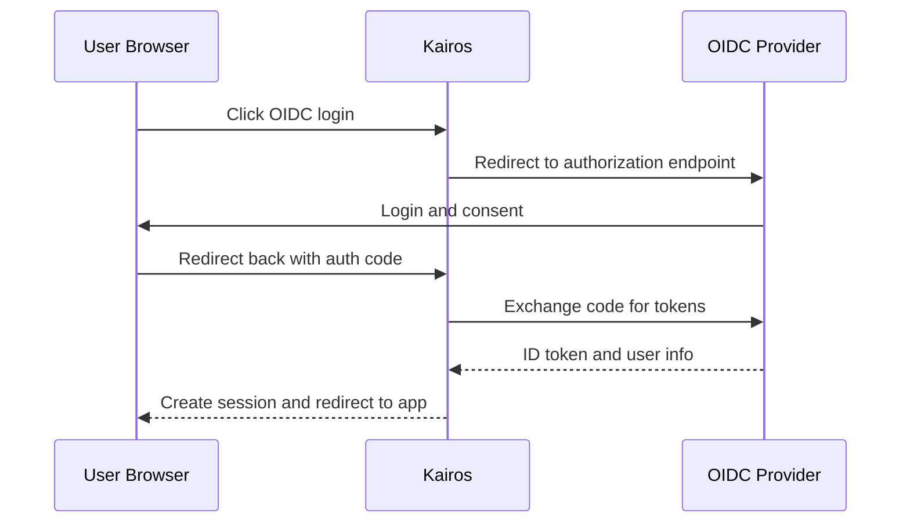

# Configuration: OIDC / OAuth2

Kairos supports OpenID Connect in addition to local login.

When OIDC is enabled, the login page shows a second button for OIDC login.

## Login Flow



## Required Environment Variables

| Variable | Required | Description |
|----------|----------|-------------|
| `OIDC_ENABLED` | Yes | Set to `true` to enable OIDC |
| `OIDC_CREATEUSERS` | No | Set to `false` to allow only already existing Kairos users; defaults to `true` |
| `OIDC_CLIENT_ID` | Yes | Client ID registered with your identity provider |
| `OIDC_CLIENT_SECRET` | Yes | Client secret registered with your identity provider |
| `OIDC_ISSUER_URI` | Yes | OIDC issuer base URI |

When deploying with the Helm chart, `OIDC_CLIENT_SECRET` can be provided either through `env.OIDC_CLIENT_SECRET` or through `secrets.OIDC_CLIENT_SECRET`. The `secrets` variant is preferred. If both are set, the Secret-backed value takes precedence.

## Keycloak Example

```bash
OIDC_ENABLED=true
OIDC_CREATEUSERS=true
OIDC_CLIENT_ID=kairos
OIDC_CLIENT_SECRET=<your-secret>
OIDC_ISSUER_URI=https://keycloak.example.com/realms/myrealm
```

Kairos derives OIDC endpoints from the issuer URI:

| Endpoint | Path suffix |
|----------|-------------|
| Authorization | `/protocol/openid-connect/auth` |
| Token | `/protocol/openid-connect/token` |
| User info | `/protocol/openid-connect/userinfo` |
| JWK set | `/protocol/openid-connect/certs` |

Redirect URI to register in your provider:

```text
https://<your-kairos-host>/login/oauth2/code/oidc
```

## Role Mapping

- OIDC users are auto-provisioned with `USER` role by default.
- Set `OIDC_CREATEUSERS=false` when you want OIDC login to be limited to users that already exist in Kairos.
- Promote users to `ADMIN` in **Admin -> Users** when needed.
